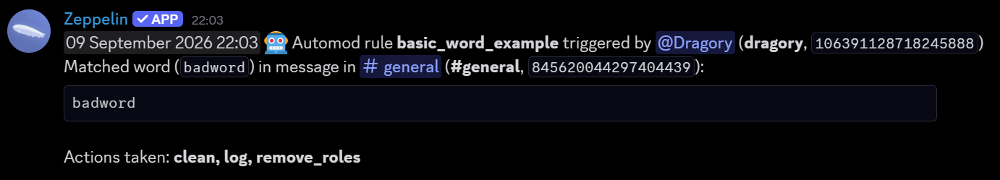
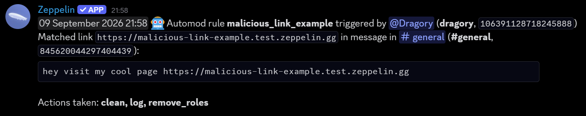
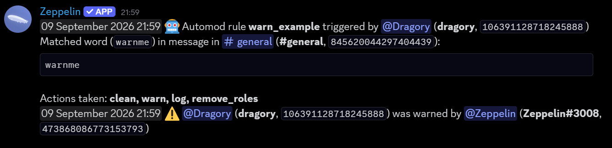
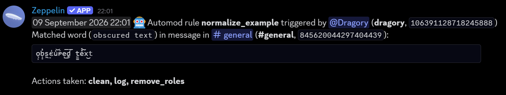
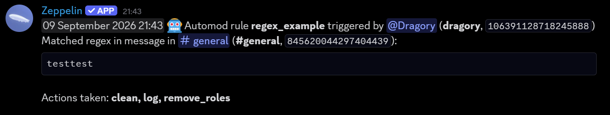
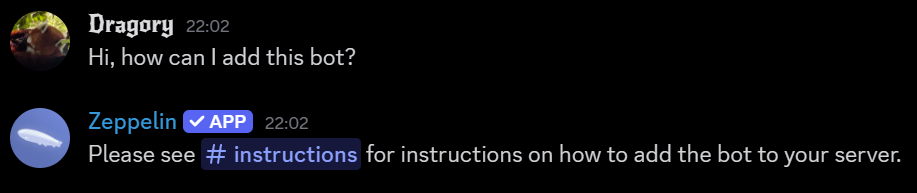
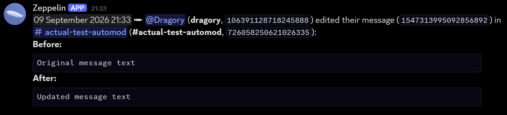
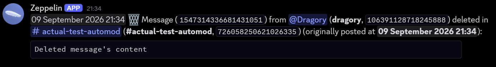
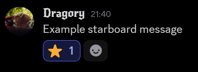
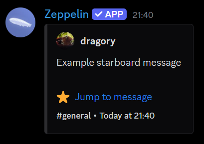

# Message Content intent - Screenshots
This page includes screenshots of Zeppelin features that use the Message Content intent.

# Auto-moderation
Basic word matching

Malicious link matching

Automatic mod actions

Fuzzy word-matching (normalizing)

Advanced regex matching. The regex used in this example, `(t.{3})\1`, uses backreferences, which are not available in Discord's native automod.

Automatic bot replies

# Message edit logs

# Message deletion logs

# Starboard

